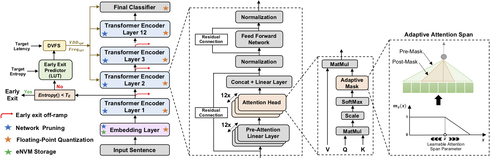

EdgeBERT
========

EdgeBERT is a HW/SW co-design enabling sentence-level energy optimizations for latency-aware multi-task NLP inference. In this repo, we provide both the software and hardware modelings. For full details, please check out [this paper](https://arxiv.org/pdf/2011.14203.pdf). 



## Directory structure

* `hw/cmod/include/*.h` contains header files for functions and classes from EdgeBERT
* `hw/cmod/<module>` sub-directories contain EdgeBERT SystemC modules
* `hw/matchlib` library of synthesizable hardware components from NVIDIA

* `sw/Entropy_LUT` contains the entropy datasets and a notebook to train the entropy prediction LUT (as well as a sample pretrained LUT)
* `sw/EdgeBERT/transformers` contains a modified version of the HuggingFace Transformers library
* `sw/EdgeBERT/examples` contains python scripts for training and evaluating models
* `sw/EdgeBERT/scripts` contains shell scripts to run our software workflow

## Citation

If you find this resource useful, please consider citing the following paper:
```
@inproceedings{edgebert_micro2021, 
  author = {Tambe, Thierry and Hooper, Coleman and Pentecost, Lillian and Jia, Tianyu 
            and Yang, En-Yu and Donato, Marco and Sanh, Victor and Whatmough, Paul N.
            and Rush, Alexander M. and Brooks, David and Wei, Gu-Yeon}, 
  title = {EdgeBERT: Sentence-Level Energy Optimizations for Latency-Aware Multi-Task NLP Inference},
  publisher = {Association for Computing Machinery},
  booktitle = {Proceedings of the 54th Annual IEEE/ACM International Symposium on Microarchitecture},
  year = {2021},
}
```
## Contact Us
For any further questions please contact ttambe@g.harvard.edu
